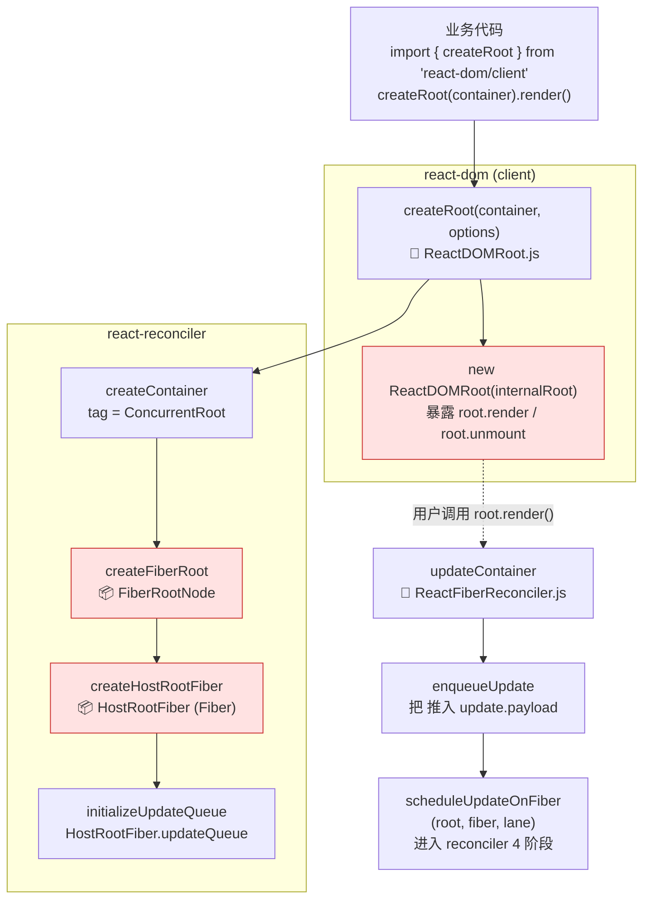
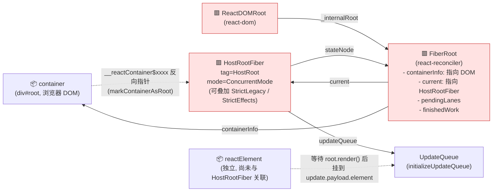

# React 应用的启动过程

在前文[`reconciler 运作流程`](./reconciler-workflow.md)把`reconciler`的流程归结成 4 个步骤.

本章节主要讲解`react`应用程序的启动过程, 位于`react-dom`包, 衔接`reconciler 运作流程`中的[`输入`](./reconciler-workflow.md#输入)步骤.

在正式分析源码之前, 先了解一下`react`应用的`启动模式`:

> 历史背景: 在`react@17`时代, 共有 3 种启动模式(`legacy`、`blocking`、`concurrent`), 对应 3 套 RootTag 与 mode 位; 自`react@18`起官方移除了`ReactDOM.render`与`createBlockingRoot`, 只剩 2 种启动方式: `createRoot`(默认开启`Concurrent`渲染) 与 `hydrateRoot`(SSR 场景的同构启动). 业务代码无法再走 v17 的 legacy 路径, react 内部仅在某些 SSR/单元测试桥接位置保留`LegacyRoot`枚举.

`react@19.2.6`中暴露的启动 api 如下:

1. **`createRoot`**: 客户端首次渲染. 创建一个`ReactDOMRoot`实例, 通过实例的`render`方法引导启动, 默认为`ConcurrentRoot`.

   ```js
   import { createRoot } from 'react-dom/client';

   // 1. 创建 ReactDOMRoot 对象
   const root = createRoot(document.getElementById('root'));
   // 2. 调用 render (不再支持 callback, 这是与 v17 ReactDOM.render 的主要差异)
   root.render(<App />);
   // 3. 卸载
   // root.unmount();
   ```

2. **`hydrateRoot`**: SSR 同构启动. 创建一个`ReactDOMHydrationRoot`实例, 用于复用服务端渲染产生的 DOM 结构.

   ```js
   import { hydrateRoot } from 'react-dom/client';

   // hydrateRoot 把 <App/> 作为第二个参数直接传入, 一步到位
   const root = hydrateRoot(document.getElementById('root'), <App />);
   // 后续如果需要触发整树更新, 仍然走 root.render(<App />)
   ```

注意:

- 自 v18 起, `createRoot` / `hydrateRoot` 一律导出自`react-dom/client`子路径(不再是`react-dom`顶级).
- v17 中的`ReactDOM.render(<App/>, container)`已删除. 若工程升级时仍调用该 API, react 会在控制台抛出一次性的 deprecation 警告并直接报错.
- v17 中的`createBlockingRoot` / `createMutableSource` / `unstable_*` 系列实验 API 已全部移除.

## 启动流程

在调用入口函数之前,`reactElement(<App/>)`和 DOM 对象`div#root`之间没有关联, 用图片表示如下:


### 创建全局对象 {#create-global-obj}

无论使用`createRoot`还是`hydrateRoot`, react 在初始化时, 都会创建 3 个全局对象:

1. [`ReactDOMRoot` / `ReactDOMHydrationRoot` 对象](https://github.com/facebook/react/blob/v19.2.6/packages/react-dom/src/client/ReactDOMRoot.js)

   - 属于`react-dom`包. 实例上暴露`render`和`unmount`方法, 通过调用`render`方法可以引导 react 应用启动.

2. [`fiberRoot` 对象](https://github.com/facebook/react/blob/v19.2.6/packages/react-reconciler/src/ReactFiberRoot.js)

   - 属于`react-reconciler`包, 作为`react-reconciler`在运行过程中的全局上下文, 保存 fiber 构建过程中所依赖的全局状态.
   - 其大部分实例变量用来存储`fiber 构造循环`(详见[`两大工作循环`](./workloop.md))过程的各种状态. react 应用内部, 可以根据这些实例变量的值, 控制执行逻辑.

3. [`HostRootFiber` 对象](https://github.com/facebook/react/blob/v19.2.6/packages/react-reconciler/src/ReactFiber.js)
   - 属于`react-reconciler`包, 这是 react 应用中的第一个 Fiber 对象, 是 Fiber 树的根节点, 节点的类型是`HostRoot`.

这 3 个对象是 react 体系得以运行的基本保障, 一经创建大多数场景不会再销毁(除非卸载整个应用`root.unmount()`).

这一过程是从`react-dom`包发起, 内部调用了`react-reconciler`包, 核心流程图如下(其中红色标注了 3 个对象的创建时机).


> 注: 该图绘制于 v17 时期, 当时分 legacy/blocking/concurrent 三条线; v19 中只剩 `createRoot → ReactDOMRoot → createContainer → createFiberRoot → createHostRootFiber` 一条线.

下方为 v19 等价流程图(Mermaid, 如未渲染请复制到 [mermaid.live](https://mermaid.live)):



> 🔴 红色节点为三大全局对象的创建时机: `ReactDOMRoot`(渲染器入口实例)、`FiberRoot`(协调器根对象)、`HostRootFiber`(双缓冲根 Fiber).

下面逐一解释这 3 个对象的创建过程.

### 创建 ReactDOMRoot 对象

`createRoot` ([源码](https://github.com/facebook/react/blob/v19.2.6/packages/react-dom/src/client/ReactDOMRoot.js)) 的核心代码可简化为:

```js
export function createRoot(
  container: Element | Document | DocumentFragment,
  options?: CreateRootOptions,
): RootType {
  // 1. 创建 fiberRoot, RootTag 固定为 ConcurrentRoot
  const root = createContainer(
    container,
    ConcurrentRoot,
    null, // hydrationCallbacks
    isStrictMode, // 来自 options
    concurrentUpdatesByDefaultOverride,
    identifierPrefix,
    onUncaughtError,
    onCaughtError,
    onRecoverableError,
    transitionCallbacks,
  );
  // 2. 在容器 DOM 节点上标记 fiber, 方便事件系统反查
  markContainerAsRoot(root.current, container);
  // 3. 把事件系统监听一次性挂到容器上 (delegated events)
  const rootContainerElement =
    container.nodeType === COMMENT_NODE ? container.parentNode : container;
  listenToAllSupportedEvents(rootContainerElement);

  // 4. 返回包装对象, 实例上挂 render / unmount
  return new ReactDOMRoot(root);
}

function ReactDOMRoot(internalRoot: FiberRoot) {
  this._internalRoot = internalRoot;
}
ReactDOMRoot.prototype.render = function (children: ReactNodeList): void {
  updateContainer(children, this._internalRoot, null, null);
};
ReactDOMRoot.prototype.unmount = function (): void {
  const root = this._internalRoot;
  const container = root.containerInfo;
  updateContainer(null, root, null, () => {
    unmarkContainerAsRoot(container);
  });
};
```

通过以上分析,`createRoot`有 4 个核心步骤:

1. 调用`createContainer`创建`fiberRoot`(注意`RootTag`固定为`ConcurrentRoot`).
2. 把`fiberRoot.current`挂到容器节点上, 方便事件系统反查到对应 fiber.
3. 把 React 支持的所有原生事件一次性代理到容器节点上(详见[合成事件原理](./synthetic-event.md)).
4. `new ReactDOMRoot(...)` 包装出实例, 暴露`render`/`unmount`.

`hydrateRoot`与`createRoot`几乎一致, 差别只在`RootTag`一致为`ConcurrentRoot`, 但创建`fiberRoot`时`hydrate: true`且把首次的`<App/>`存入根更新队列.

### 创建 fiberRoot 对象 {#create-root-impl}

无论是`createRoot`还是`hydrateRoot`, 都会调用一个相同的函数`createContainer` → `createFiberRoot`([源码](https://github.com/facebook/react/blob/v19.2.6/packages/react-reconciler/src/ReactFiberRoot.js)):

```js
export function createContainer(
  containerInfo: Container,
  tag: RootTag,
  hydrationCallbacks: null | SuspenseHydrationCallbacks,
  isStrictMode: boolean,
  concurrentUpdatesByDefaultOverride: null | boolean,
  identifierPrefix: string,
  onUncaughtError: (error: mixed) => void,
  onCaughtError: (
    error: mixed,
    errorInfo: { +componentStack?: ?string },
  ) => void,
  onRecoverableError: (error: mixed) => void,
  transitionCallbacks: null | TransitionTracingCallbacks,
): OpaqueRoot {
  const hydrate = false;
  const initialChildren = null;
  return createFiberRoot(
    containerInfo,
    tag,
    hydrate,
    initialChildren,
    hydrationCallbacks,
    isStrictMode,
    concurrentUpdatesByDefaultOverride,
    identifierPrefix,
    onUncaughtError,
    onCaughtError,
    onRecoverableError,
    transitionCallbacks,
  );
}
```

### 创建 HostRootFiber 对象

在`createFiberRoot`中, 创建了`react`应用的首个`fiber`对象, 称为`HostRootFiber(fiber.tag = HostRoot)`:

```js
export function createFiberRoot(
  containerInfo: any,
  tag: RootTag,
  hydrate: boolean,
  initialChildren: ReactNodeList,
  hydrationCallbacks: null | SuspenseHydrationCallbacks,
  isStrictMode: boolean,
  concurrentUpdatesByDefaultOverride: null | boolean,
  identifierPrefix: string,
  // ... 省略错误回调入参
): FiberRoot {
  // 创建 fiberRoot 对象 (FiberRootNode 实例)
  const root: FiberRoot = (new FiberRootNode(
    containerInfo,
    tag,
    hydrate,
    identifierPrefix /* ... */,
  ): any);

  // 1. 创建 HostRootFiber (react 应用首个 fiber 对象)
  const uninitializedFiber = createHostRootFiber(
    tag,
    isStrictMode,
    concurrentUpdatesByDefaultOverride,
  );
  root.current = uninitializedFiber;
  uninitializedFiber.stateNode = root;

  // 2. 初始化 HostRoot 的内存状态 (含 hydration cache)
  const initialState = {
    element: initialChildren,
    isDehydrated: hydrate,
    cache: createCache(), // v18 新增: 用于 use(promise) 的资源缓存
  };
  uninitializedFiber.memoizedState = initialState;

  // 3. 初始化 HostRoot 的 updateQueue
  initializeUpdateQueue(uninitializedFiber);

  return root;
}
```

在创建`HostRootFiber`时, 其`fiber.mode`属性会与`RootTag`关联起来. v19 中只剩 2 种 RootTag(`LegacyRoot` 内部保留, `ConcurrentRoot` 业务唯一入口):

```js
export function createHostRootFiber(
  tag: RootTag,
  isStrictMode: boolean,
  concurrentUpdatesByDefaultOverride: null | boolean,
): Fiber {
  let mode;
  if (tag === ConcurrentRoot) {
    mode = ConcurrentMode;
    if (isStrictMode === true || createRootStrictEffectsByDefault) {
      mode |= StrictLegacyMode | StrictEffectsMode;
    }
  } else {
    mode = NoMode;
  }
  return createFiber(HostRoot, null, null, mode);
}
```

注意:

- `fiber`树中所有节点的`mode`都会和`HostRootFiber.mode`一致(新建的 fiber 节点, 其 mode 来源于父节点), 所以**`HostRootFiber.mode`非常重要**, 它决定了以后整个 fiber 树构建过程.
- v17 时代的`BlockingMode`已被删除. v19 中常见的 mode 位有: `ConcurrentMode`、`StrictLegacyMode`、`StrictEffectsMode`、`NoStrictPassiveEffectsMode`、`SuspenseyImagesMode`(详见[`ReactTypeOfMode.js`](https://github.com/facebook/react/blob/v19.2.6/packages/react-reconciler/src/ReactTypeOfMode.js)).

运行到这里, 3 个对象创建成功, `react`应用的初始化完毕.

将此刻内存中各个对象的引用情况表示出来:


> 注: 该图是 v17 时期 concurrent 启动方式下的快照; v19 中无论用 `createRoot` 还是 `hydrateRoot`, 内存引用关系都与此图一致(HostRootFiber.mode 默认为 ConcurrentMode), legacy/blocking 两张图(`process-legacy.png` / `process-blocking.png`) 已不再适用.

下方为 v19 等价的内存引用关系图(Mermaid):



> 🔴 红色节点为初始化时被创建的 3 个全局对象, 三者之间通过 `stateNode` / `_internalRoot` / `current` 构成完整的双向引用. 容器 DOM 通过 `markContainerAsRoot` 反向挂载 `HostRootFiber`, 用于事件冒泡时定位.

注意:

1. `HostRootFiber.mode = ConcurrentMode`(开启 StrictMode 时还会附加`StrictLegacyMode | StrictEffectsMode`).
2. v19 中, `container` DOM 与`HostRootFiber`之间通过`fiberRoot.containerInfo`/`internalContainerInstanceKey`双向关联(`markContainerAsRoot`完成的事).
3. 此时`reactElement(<App/>)`还是独立在外的, 还没有和目前创建的 3 个全局对象关联起来.

## 调用更新入口

v19 中`createRoot` / `hydrateRoot` 都通过实例的`render`方法触发首次更新:

```js
ReactDOMRoot.prototype.render = function (children: ReactNodeList): void {
  const root = this._internalRoot;
  // 串联 react-dom 与 react-reconciler 的入口
  updateContainer(children, root, null, null);
};
```

> 与 v17 的关键差异:
>
> - v17 中`legacy`模式会在`unbatchedUpdates`下变更`executionContext = LegacyUnbatchedContext`再调用`updateContainer`. v18 起这条分支被删除, 所有更新都走统一路径, 由`ensureRootIsScheduled`在 microtask 中决定同步/并发.
> - v18 起整个 react 应用都默认运行在 Concurrent 渲染器下, 但**只有使用了`useTransition` / `startTransition` / `useDeferredValue`等并发特性, 才会真正分片渲染**; 默认更新(`setState`、`dispatch`)依然以同步车道(`SyncLane / DefaultLane`)冲刷.

继续跟踪[`updateContainer`函数](https://github.com/facebook/react/blob/v19.2.6/packages/react-reconciler/src/ReactFiberReconciler.js):

```js
export function updateContainer(
  element: ReactNodeList,
  container: OpaqueRoot,
  parentComponent: ?React$Component<any, any>,
  callback: ?Function,
): Lane {
  const current = container.current;
  // 1. 选取本次更新的 lane (v19 不再用 eventTime + requestUpdateLane 双参数)
  const lane = requestUpdateLane(current);

  // 2. 创建 update, 把要渲染的 element 放到 payload 上
  const update = createUpdate(lane);
  update.payload = { element };
  callback = callback === undefined ? null : callback;
  if (callback !== null) {
    update.callback = callback;
  }

  // 3. 将 update 加入 HostRootFiber 的 updateQueue
  const root = enqueueUpdate(current, update, lane);
  if (root !== null) {
    // 4. 进入 reconciler 运作流程中的 `输入` 环节
    scheduleUpdateOnFiber(root, current, lane);
    entangleTransitions(root, current, lane);
  }
  return lane;
}
```

`updateContainer`函数位于`react-reconciler`包中, 它串联了`react-dom`与`react-reconciler`. 它最后调用了`scheduleUpdateOnFiber(root, fiber, lane)`.

在前文[`reconciler 运作流程`](./reconciler-workflow.md)中, 重点分析过`scheduleUpdateOnFiber`是`输入`阶段的入口函数.

所以到此为止, 通过调用`react-dom/client`包的`api`(如: `createRoot(...).render(<App/>)`), `react`内部经过一系列运转, 完成了初始化, 并且进入了`reconciler 运作流程`的第一个阶段.

## 思考

### 可中断渲染

react 中最广为人知的可中断渲染(render 可以中断, 部分生命周期函数有可能执行多次, `UNSAFE_componentWillMount`、`UNSAFE_componentWillReceiveProps`)只有在`HostRootFiber.mode & ConcurrentMode`时才会开启. 在 v19 中, 通过`createRoot`启动的应用默认就满足这个条件.

但 "默认运行在 Concurrent 渲染器下" 不等于 "每一次更新都会被时间切片". 实际行为是这样的:

- **默认更新(SyncLane / DefaultLane)**: 由`microtask`冲刷, 整个 render 阶段不会让出主线程, 表现与 v17 sync 更新一致.
- **过渡更新(`useTransition` / `startTransition`)**: 落到`TransitionLane`, 走`renderRootConcurrent` → `workLoopConcurrent`, 每个`performUnitOfWork`完成后通过`shouldYield()`检查时间切片, 真正发生可中断渲染.
- **延迟更新(`useDeferredValue`)**: 落到`DeferredLane`, 同样可被中断.

对于`可中断渲染`的宣传最早来自[2017 年 Lin Clark 的演讲](https://conf2017.reactjs.org/speakers/lin), 直到[`v18.0.0`](https://github.com/facebook/react/blob/main/CHANGELOG.md#1800-march-29-2022)才真正落地到生产稳定版. 在`v19.2.6`中, Concurrent 已经是默认渲染器, 但**是否分片渲染**仍取决于是否使用了上述并发 API.

### 与 v17 启动流程的差异总结

| 维度            | v17.0.2                                                                      | v19.2.6                                          |
| --------------- | ---------------------------------------------------------------------------- | ------------------------------------------------ | ------------------------- | ----------- | ---------------------------------------- | ------------------------------------------ |
| 入口 API        | `ReactDOM.render` / `ReactDOM.hydrate` / `createBlockingRoot` / `createRoot` | `createRoot` / `hydrateRoot`(`react-dom/client`) |
| RootTag         | `LegacyRoot` / `BlockingRoot` / `ConcurrentRoot`                             | `ConcurrentRoot`(`LegacyRoot`仅内部桥接)         |
| Mode 位         | `NoMode` / `ConcurrentMode                                                   | BlockingMode                                     | StrictMode`/`BlockingMode | StrictMode` | `ConcurrentMode`(可叠加`StrictLegacyMode | StrictEffectsMode`, `BlockingMode` 已删除) |
| 调度入口        | 同步绕过调度 / 经 Scheduler                                                  | 全部走`ensureRootIsScheduled` → microtask 决策   |
| render callback | `ReactDOM.render(..., callback)`支持                                         | `root.render(...)`不再支持 callback              |
| 事件代理节点    | rootContainer (v17 已迁移)                                                   | rootContainer (一致)                             |

## 总结

本章节介绍了`react`应用的 2 种启动方式(`createRoot` / `hydrateRoot`). 分析了启动后创建的 3 个关键对象, 并简单梳理了对象在内存中的引用关系. 启动过程最后调用`updateContainer`进入`react-reconciler`包, 进而调用`scheduleUpdateOnFiber`函数, 与`reconciler 运作流程`中的`输入`阶段相衔接.
