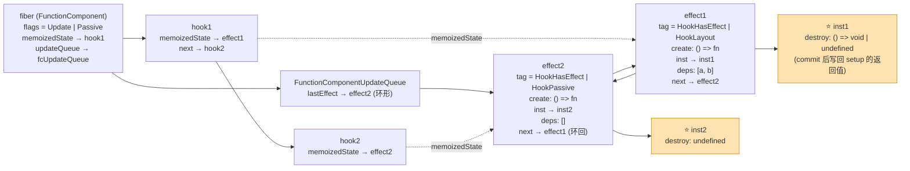
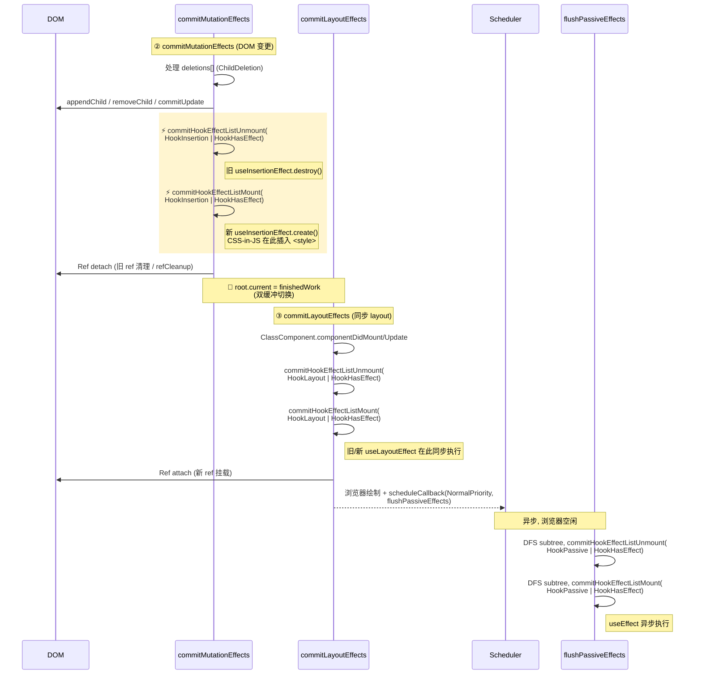
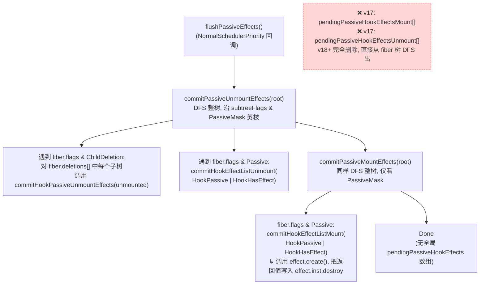

# Hook 原理(副作用 Hook)

本节建立在前文[Hook 原理(概览)](./hook-summary.md)和[Hook 原理(状态 Hook)](./hook-state.md)的基础之上, 重点讨论`useEffect, useLayoutEffect, useInsertionEffect`等标准的`副作用Hook`.

> v17 → v19 重大变化:
>
> 1. **新增 `useInsertionEffect`** (v18): 同步执行, 在 mutation 阶段早于`useLayoutEffect`, 给 CSS-in-JS 库一个"DOM 已变更但 layout 未读取"的窗口.
> 2. **`fiber.flags`位语义调整**: 原`UpdateEffect | PassiveEffect`被拆分为更细的`Update`、`Passive`位; useLayoutEffect 仅打`Update`位, useEffect 打`Passive`位, useInsertionEffect 打`Update`位但 hookFlags 为`HookInsertion`.
> 3. **副作用调度方式**: v17 在`commitBeforeMutationEffects`中遍历 effect 链表为每个带`Passive`位的节点逐个`scheduleCallback`. v18 起改为在`commitRootImpl`开头一次性`scheduleCallback(NormalSchedulerPriority, flushPassiveEffects)`.
> 4. **删除节点路径变化**: v18 起删除路径是`recursivelyTraverseMutationEffects → commitDeletionEffects → commitDeletionEffectsOnFiber`, 内部仍然会执行 effect.destroy.

## 创建 Hook

在`fiber`初次构造阶段, 三种 effect hook 对应源码:

- `useEffect`: [mountEffect](https://github.com/facebook/react/blob/v19.2.6/packages/react-reconciler/src/ReactFiberHooks.js)
- `useLayoutEffect`: [mountLayoutEffect](https://github.com/facebook/react/blob/v19.2.6/packages/react-reconciler/src/ReactFiberHooks.js)
- `useInsertionEffect` (v18+): [mountInsertionEffect](https://github.com/facebook/react/blob/v19.2.6/packages/react-reconciler/src/ReactFiberHooks.js)

`mountEffect`:

```js
function mountEffect(
  create: () => (() => void) | void,
  deps: Array<mixed> | void | null,
): void {
  return mountEffectImpl(
    PassiveEffect | PassiveStaticEffect, // fiberFlags (v18+)
    HookPassive, // hookFlags
    create,
    deps,
  );
}
```

`mountLayoutEffect`:

```js
function mountLayoutEffect(
  create: () => (() => void) | void,
  deps: Array<mixed> | void | null,
): void {
  let fiberFlags: Flags = UpdateEffect | LayoutStaticEffect;
  return mountEffectImpl(fiberFlags, HookLayout, create, deps);
}
```

`mountInsertionEffect` (v18+):

```js
function mountInsertionEffect(
  create: () => (() => void) | void,
  deps: Array<mixed> | void | null,
): void {
  return mountEffectImpl(UpdateEffect, HookInsertion, create, deps);
}
```

可见三者内部都调用[mountEffectImpl](https://github.com/facebook/react/blob/v19.2.6/packages/react-reconciler/src/ReactFiberHooks.js), 只是参数不同.

`mountEffectImpl`:

```js
function mountEffectImpl(fiberFlags, hookFlags, create, deps): void {
  // 1. 创建 hook
  const hook = mountWorkInProgressHook();
  const nextDeps = deps === undefined ? null : deps;
  // 2. 设置 workInProgress 的副作用标记
  currentlyRenderingFiber.flags |= fiberFlags;
  // 3. 创建 Effect, 挂载到 hook.memoizedState 上
  hook.memoizedState = pushEffect(
    HookHasEffect | hookFlags,
    create,
    createEffectInstance(), // v18 起 effect 包了一层 inst 对象, 用于跨 commit 复用 destroy
    nextDeps,
  );
}
```

`mountEffectImpl`逻辑:

1. 创建`hook`.
2. 设置`workInProgress`的副作用标记: `flags |= fiberFlags`.
3. 创建`effect`(在`pushEffect`中), 挂载到`hook.memoizedState`上, 即`hook.memoizedState = effect`.
   - 注意: `状态Hook`中`hook.memoizedState = state`.

### 创建 Effect

[pushEffect](https://github.com/facebook/react/blob/v19.2.6/packages/react-reconciler/src/ReactFiberHooks.js):

```js
function pushEffect(tag, create, inst, deps): Effect {
  // 1. 创建 effect 对象 (v18+: 多了 inst 字段)
  const effect: Effect = {
    tag,
    create,
    inst,
    deps,
    next: (null: any),
  };
  // 2. 把 effect 对象添加到环形链表末尾
  let componentUpdateQueue: null | FunctionComponentUpdateQueue =
    (currentlyRenderingFiber.updateQueue: any);
  if (componentUpdateQueue === null) {
    componentUpdateQueue = createFunctionComponentUpdateQueue();
    currentlyRenderingFiber.updateQueue = (componentUpdateQueue: any);
    componentUpdateQueue.lastEffect = effect.next = effect;
  } else {
    const lastEffect = componentUpdateQueue.lastEffect;
    if (lastEffect === null) {
      componentUpdateQueue.lastEffect = effect.next = effect;
    } else {
      const firstEffect = lastEffect.next;
      lastEffect.next = effect;
      effect.next = firstEffect;
      componentUpdateQueue.lastEffect = effect;
    }
  }
  return effect;
}
```

`pushEffect`逻辑:

1. 创建`effect`.
2. 把`effect`对象添加到环形链表末尾.
3. 返回`effect`.

`effect`的数据结构 (v18+):

```js
export type Effect = {
  tag: HookFlags,
  create: () => (() => void) | void,
  inst: EffectInstance, // v18 新增: 跨 commit 持有 destroy
  deps: Array<mixed> | null,
  next: Effect,
};

type EffectInstance = {
  destroy: void | (() => void),
};
```

> v17 → v18: effect 由直接持有`destroy`字段改为持有`inst.destroy`. 原因是在并发场景中, 同一个 effect 可能因为渲染被丢弃 -> 重做, 用 inst 包一层可以保证 destroy 始终能拿到上一次 setup 的返回值.

- `effect.tag`: 使用位掩码形式, 代表`effect`的类型([源码](https://github.com/facebook/react/blob/v19.2.6/packages/react-reconciler/src/ReactHookEffectTags.js)).

  ```js
  // v18+
  export const NoFlags = /*       */ 0b0000;
  export const HasEffect = /*     */ 0b0001; // 有副作用, 可被触发
  export const Insertion = /*     */ 0b0010; // Insertion 阶段 (v18 新增)
  export const Layout = /*        */ 0b0100; // Layout 阶段
  export const Passive = /*       */ 0b1000; // Passive 阶段
  ```

- `effect.create`: 实际上就是通过`useEffect/useLayoutEffect/useInsertionEffect`所传入的 setup 函数.
- `effect.deps`: 依赖项, 如果依赖项变动, 会在更新阶段重新打`HasEffect`位.

`renderWithHooks`执行完成后, 我们可以画出`fiber`,`hook`,`effect`三者的引用关系:


> 注: 此图绘制于 v17 时期, 图中 effect 节点没有`inst`字段, v19 中需要加上.

下方为 v19 版本的 fiber → hook → effect → inst 引用关系图(Mermaid):



> ⭐ 橙色节点是 v18 新增的 `inst` 包装层(`EffectInstance`). v17 时期 `destroy` 直接挂在 `effect` 自身, 一旦渲染被丢弃就会丢失;  
> v18+ 把 `destroy` 单独提取到 `inst`(在多次 render 之间共享同一个对象引用), 这样即使本次渲染被丢弃, 下一次 commit 仍能拿到上一次 setup 返回的清理函数.

现在`workInProgress.flags`被打上了标记, 最后会在`fiber树渲染`阶段的`commitRoot`函数中处理. (这期间的所有过程可以回顾前文`fiber树构造/fiber树渲染`系列, 此处不再赘述)

### useEffect / useLayoutEffect / useInsertionEffect

站在`fiber, hook, effect`的视角, 无需关心这个`hook`是通过哪一个 api 创建的, 只需要关心内部`fiber.flags`、`effect.tag`的状态.

三种 effect hook 的标志位区别:

| Hook                       | `fiber.flags` 标志位       | `effect.tag` 标志位              | 执行阶段                                   |
| -------------------------- | -------------------------- | -------------------------------- | ------------------------------------------ |
| `useEffect`                | `Passive \| PassiveStatic` | `HookHasEffect \| HookPassive`   | commit 完成后异步冲刷                      |
| `useLayoutEffect`          | `Update \| LayoutStatic`   | `HookHasEffect \| HookLayout`    | `commitLayoutEffects`, 同步                |
| `useInsertionEffect` (v18) | `Update`                   | `HookHasEffect \| HookInsertion` | `commitMutationEffects`, 同步, 早于 layout |

> v18 起新增的`StaticMask`(`PassiveStatic / LayoutStatic / RefStatic`等), 用于"即使 bailout 也保留位"以保证后续 render 还能定位到挂着 effect 的节点.

## 处理 Effect 回调

完成`fiber树构造`后, 逻辑会进入`渲染`阶段. 通过[fiber 树渲染](./fibertree-commit.md)中的介绍, 在`commitRootImpl`函数中, 整个渲染过程被 3 个函数分布实现:

1. [commitBeforeMutationEffects](https://github.com/facebook/react/blob/v19.2.6/packages/react-reconciler/src/ReactFiberCommitWork.js)
2. [commitMutationEffects](https://github.com/facebook/react/blob/v19.2.6/packages/react-reconciler/src/ReactFiberCommitWork.js)
3. [commitLayoutEffects](https://github.com/facebook/react/blob/v19.2.6/packages/react-reconciler/src/ReactFiberCommitWork.js)

这 3 个函数会根据`fiber.flags / subtreeFlags`进行 DFS, 并处理`fiber.updateQueue.lastEffect`(effect 环形链表).

> v18+ 与 v17 最大的差别: 不再有"effect list 链表"在 fiber 之间游走. 每个函数都自带 begin/complete DFS, 依靠`subtreeFlags`剪枝.

### commitBeforeMutationEffects

第一阶段: DOM 变更之前. v19 中**不再**在此处处理 Passive 标记(已统一移到`commitRootImpl`开头的`scheduleCallback`):

```js
// v19 简化版
function commitBeforeMutationEffectsOnFiber(finishedWork: Fiber) {
  const flags = finishedWork.flags;
  switch (finishedWork.tag) {
    case ClassComponent: {
      if (flags & Snapshot) {
        // ClassComponent: getSnapshotBeforeUpdate
        // ...
      }
      return;
    }
    case HostRoot: {
      if (flags & Snapshot)
        clearContainer(finishedWork.stateNode.containerInfo);
      return;
    }
  }
}
```

`useEffect`的调度统一在`commitRootImpl`入口完成(参见[fibertree-commit.md 渲染前](./fibertree-commit.md#渲染前)):

```js
if (
  (finishedWork.subtreeFlags & PassiveMask) !== NoFlags ||
  (finishedWork.flags & PassiveMask) !== NoFlags
) {
  if (!rootDoesHavePassiveEffects) {
    rootDoesHavePassiveEffects = true;
    pendingPassiveEffectsRemainingLanes = remainingLanes;
    scheduleCallback(NormalSchedulerPriority, () => {
      flushPassiveEffects();
      return null;
    });
  }
}
```

> 由于`flushPassiveEffects`被包裹在`scheduleCallback`回调中, 由`调度中心`处理, 参数是`NormalSchedulerPriority`, 故是异步回调(具体原理可以回顾[React 调度原理(scheduler)](./scheduler.md)).

### commitMutationEffects

第二阶段: DOM 变更, 界面得到更新.

v18+ 在该阶段同步执行`useInsertionEffect`和`useLayoutEffect 的 cleanup`:

```js
// v19 简化版
function commitMutationEffectsOnFiber(
  finishedWork: Fiber,
  root: FiberRoot,
  lanes: Lanes,
) {
  const current = finishedWork.alternate;
  const flags = finishedWork.flags;

  switch (finishedWork.tag) {
    case FunctionComponent:
    case ForwardRef:
    case SimpleMemoComponent: {
      recursivelyTraverseMutationEffects(root, finishedWork, lanes);
      commitReconciliationEffects(finishedWork);
      if (flags & Update) {
        // ⚠️ v18 关键: 在 DOM 突变之后, layout 阶段之前, 同步执行 useInsertionEffect
        commitHookEffectListUnmount(
          HookInsertion | HookHasEffect,
          finishedWork,
          finishedWork.return,
        );
        commitHookEffectListMount(HookInsertion | HookHasEffect, finishedWork);

        // 同步执行 useLayoutEffect 的 cleanup (setup 留到 layout 阶段)
        commitHookEffectListUnmount(
          HookLayout | HookHasEffect,
          finishedWork,
          finishedWork.return,
        );
      }
      return;
    }
    case HostComponent: {
      recursivelyTraverseMutationEffects(root, finishedWork, lanes);
      commitReconciliationEffects(finishedWork);
      if (flags & Update) {
        // v19 起 diff 在这里同步完成 (prepareUpdate 已删除)
        commitUpdate(
          finishedWork.stateNode,
          finishedWork.type,
          current !== null ? current.memoizedProps : finishedWork.memoizedProps,
          finishedWork.memoizedProps,
          finishedWork,
        );
      }
      return;
    }
  }
}

// 依次执行: effect.inst.destroy (v18+ 字段)
function commitHookEffectListUnmount(
  flags: HookFlags,
  finishedWork: Fiber,
  nearestMountedAncestor: Fiber | null,
) {
  const updateQueue: FunctionComponentUpdateQueue | null =
    (finishedWork.updateQueue: any);
  const lastEffect = updateQueue !== null ? updateQueue.lastEffect : null;
  if (lastEffect !== null) {
    const firstEffect = lastEffect.next;
    let effect = firstEffect;
    do {
      if ((effect.tag & flags) === flags) {
        const inst = effect.inst;
        const destroy = inst.destroy;
        if (destroy !== undefined) {
          inst.destroy = undefined; // 清空, 防止重复调用
          safelyCallDestroy(finishedWork, nearestMountedAncestor, destroy);
        }
      }
      effect = effect.next;
    } while (effect !== firstEffect);
  }
}
```

> v17 → v19 关键变化:
>
> - 入口由`commitWork(current, nextEffect)`变为`commitMutationEffectsOnFiber + recursivelyTraverseMutationEffects`双层 DFS, 不再依赖 effect 链表.
> - 新增`useInsertionEffect`的同步执行(setup + cleanup).
> - 仅执行 layout 的`cleanup`, 不在这里执行 setup.
> - `effect.inst.destroy`替代`effect.destroy`(v18+).

### commitLayoutEffects

第三阶段: DOM 变更后, 同步执行`useLayoutEffect`的 setup:

```js
// v19 简化版
function commitLayoutEffectOnFiber(finishedRoot, current, finishedWork, lanes) {
  const flags = finishedWork.flags;
  switch (finishedWork.tag) {
    case FunctionComponent:
    case ForwardRef:
    case SimpleMemoComponent: {
      recursivelyTraverseLayoutEffects(finishedRoot, finishedWork, lanes);
      if (flags & Update) {
        // 同步执行 useLayoutEffect 的 setup
        commitHookEffectListMount(HookLayout | HookHasEffect, finishedWork);
      }
      return;
    }
    case ClassComponent: {
      recursivelyTraverseLayoutEffects(finishedRoot, finishedWork, lanes);
      if (flags & Update) {
        // componentDidMount / componentDidUpdate
        // ...
      }
      if (flags & Ref) commitAttachRef(finishedWork);
      return;
    }
  }
}

function commitHookEffectListMount(flags: HookFlags, finishedWork: Fiber) {
  const updateQueue: FunctionComponentUpdateQueue | null =
    (finishedWork.updateQueue: any);
  const lastEffect = updateQueue !== null ? updateQueue.lastEffect : null;
  if (lastEffect !== null) {
    const firstEffect = lastEffect.next;
    let effect = firstEffect;
    do {
      if ((effect.tag & flags) === flags) {
        const create = effect.create;
        const inst = effect.inst;
        const destroy = create(); // 执行 setup
        if (typeof destroy === 'function') {
          inst.destroy = destroy; // 保存 cleanup
        } else {
          inst.destroy = undefined;
        }
      }
      effect = effect.next;
    } while (effect !== firstEffect);
  }
}
```

> v17 时期, layout 阶段还会调用`schedulePassiveEffects(finishedWork)`挨个节点把 passive effect 加入全局数组. v18+ 中此步骤**已移除**: passive effect 在 commit 入口已被统一调度, layout 阶段只关心 layout effects.

综上`commitMutationEffects`和`commitLayoutEffects`处理后, `useInsertionEffect`(同步, 早于 layout)和`useLayoutEffect`(同步)的回调都已完成. 接下来再看`useEffect`(异步, passive).


> 此图绘制于 v17 时期, v19 中需补充`useInsertionEffect`在 mutation 阶段执行的窗口.

下方为 v19 中三类 Hook Effect 在 commit 阶段的执行时序图(Mermaid):



### flushPassiveEffects

`commitRootImpl`入口异步调度了`flushPassiveEffects`. 注意 v18+ 中**不再使用**`pendingPassiveHookEffectsUnmount / pendingPassiveHookEffectsMount`两个全局数组(它们已被删除), 改为通过 DFS 整棵已提交的 fiber 树, 直接读取`fiber.flags & PassiveMask`找出节点:

```js
// v19 简化版
export function flushPassiveEffects(): boolean {
  if (rootWithPendingPassiveEffects !== null) {
    const root = rootWithPendingPassiveEffects;
    const remainingLanes = pendingPassiveEffectsRemainingLanes;
    pendingPassiveEffectsRemainingLanes = NoLanes;
    const renderPriority = lanesToEventPriority(remainingLanes);
    const priority = lowerEventPriority(DefaultEventPriority, renderPriority);
    const prevTransition = ReactSharedInternals.T;
    const previousPriority = getCurrentUpdatePriority();
    try {
      setCurrentUpdatePriority(priority);
      ReactSharedInternals.T = null;
      return flushPassiveEffectsImpl();
    } finally {
      setCurrentUpdatePriority(previousPriority);
      ReactSharedInternals.T = prevTransition;
    }
  }
  return false;
}

function flushPassiveEffectsImpl() {
  if (rootWithPendingPassiveEffects === null) return false;
  const root = rootWithPendingPassiveEffects;
  rootWithPendingPassiveEffects = null;

  const prevExecutionContext = executionContext;
  executionContext |= CommitContext;

  // 1. DFS 整棵已提交树, 执行所有 Passive effect 的 cleanup
  commitPassiveUnmountEffects(root.current);
  // 2. DFS 整棵已提交树, 执行所有 Passive effect 的 setup
  commitPassiveMountEffects(root, root.current, lanes, transitions);

  executionContext = prevExecutionContext;
  flushSyncWorkOnAllRoots(); // 处理 passive effect 中触发的同步更新
  return true;
}
```

其中`commitPassiveUnmountEffects / commitPassiveMountEffects`内部仍然是双层 DFS: 用`subtreeFlags & PassiveMask`剪枝, 命中后调用`commitHookEffectListUnmount(HookPassive | HookHasEffect, ...)`或`commitHookEffectListMount(HookPassive | HookHasEffect, ...)`.

所以, 带有`Passive`标记的`effect`在`flushPassiveEffects`中得到了完整的回调处理.


> 此图绘制于 v17 时期, v19 中已不再有`pendingPassiveHookEffectsUnmount / Mount`数组.

下方为 v19 `flushPassiveEffects` 的 DFS 执行路径示意(Mermaid):



> 关键差别: v17 在 render 阶段就把 effect 推入两个全局数组, commit 后顺序执行;  
> v19 改为 commit 完成后**直接对最新 fiber 树做两轮 DFS**(先全部 unmount, 再全部 mount), 借助 `subtreeFlags & PassiveMask` 剪枝.  
> 这样可以保证: 卸载顺序与挂载顺序在父子之间一致, 并支持 Activity/Offscreen 等场景下"部分卸载/部分挂载".

## 更新 Hook

假设在初次调用之后, 发起更新, 会再次执行`function`, 这时`function`中使用的`useEffect, useLayoutEffect, useInsertionEffect`等 api 也会再次执行.

在更新过程中`useEffect`对应源码[updateEffect](https://github.com/facebook/react/blob/v19.2.6/packages/react-reconciler/src/ReactFiberHooks.js), `useLayoutEffect`对应源码[updateLayoutEffect](https://github.com/facebook/react/blob/v19.2.6/packages/react-reconciler/src/ReactFiberHooks.js), `useInsertionEffect`对应`updateInsertionEffect`. 它们内部都会调用`updateEffectImpl`, 与初次创建时一样, 只是参数不同.

### 更新 Effect

[updateEffectImpl](https://github.com/facebook/react/blob/v19.2.6/packages/react-reconciler/src/ReactFiberHooks.js):

```js
function updateEffectImpl(fiberFlags, hookFlags, create, deps): void {
  // 1. 获取当前 hook
  const hook = updateWorkInProgressHook();
  const nextDeps = deps === undefined ? null : deps;
  const effect: Effect = hook.memoizedState; // 注意: hook.memoizedState 已经在 mount 阶段写入
  const inst = effect.inst; // v18+: 直接复用 inst, 跨 commit 持有 destroy

  if (currentHook !== null) {
    if (nextDeps !== null) {
      const prevEffect: Effect = currentHook.memoizedState;
      const prevDeps = prevEffect.deps;
      if (areHookInputsEqual(nextDeps, prevDeps)) {
        // 2.1 依赖不变, 新建 effect (tag 不含 HookHasEffect)
        hook.memoizedState = pushEffect(hookFlags, create, inst, nextDeps);
        return;
      }
    }
  }

  // 2.2 依赖改变, 打 fiber.flags, 新建 effect (tag 含 HookHasEffect)
  currentlyRenderingFiber.flags |= fiberFlags;
  hook.memoizedState = pushEffect(
    HookHasEffect | hookFlags,
    create,
    inst,
    nextDeps,
  );
}
```

`updateEffectImpl`与`mountEffectImpl`逻辑有所不同: 如果`useEffect / useLayoutEffect / useInsertionEffect`的依赖不变, 新建的`effect`对象不带`HasEffect`标记, 在 commit 阶段会被跳过.

注意: 无论依赖是否变化, 都**复用同一个`inst`**, 这样上一次 setup 的 destroy 仍然能在下一次 cleanup 时被调用(v18+ 新设计).

如下图:

- 图中第 1, 2 个`hook`其`deps`没变, 故`effect.tag`中不会包含`HookHasEffect`.
- 图中第 3 个`hook`其`deps`改变, 故`effect.tag`中继续含有`HookHasEffect`.


### 处理 Effect 回调

新的`hook`以及新的`effect`创建完成之后, 余下逻辑与初次渲染完全一致. 处理 Effect 回调时也会根据`effect.tag`进行判断: 只有`effect.tag`包含`HookHasEffect`时才会调用`inst.destroy`和`effect.create()`.

## 组件销毁

v18 起, 删除节点不再依赖`Deletion` flag + effect list, 而是放在父 fiber 的`fiber.deletions: Fiber[]`数组里. 在父 fiber 的`recursivelyTraverseMutationEffects`开头, 先依次处理`deletions`:

```js
// v19 简化版
function recursivelyTraverseMutationEffects(root, parentFiber, lanes) {
  const deletions = parentFiber.deletions;
  if (deletions !== null) {
    for (let i = 0; i < deletions.length; i++) {
      const childToDelete = deletions[i];
      commitDeletionEffects(root, parentFiber, childToDelete);
    }
  }
  if (parentFiber.subtreeFlags & MutationMask) {
    let child = parentFiber.child;
    while (child !== null) {
      commitMutationEffectsOnFiber(child, root, lanes);
      child = child.sibling;
    }
  }
}

function commitDeletionEffectsOnFiber(
  finishedRoot,
  nearestMountedAncestor,
  deletedFiber,
) {
  switch (deletedFiber.tag) {
    case FunctionComponent:
    case ForwardRef:
    case MemoComponent:
    case SimpleMemoComponent: {
      // ⚠️ 先执行 useInsertionEffect 的 cleanup (避免 css-in-js 在卸载时还残留样式)
      const updateQueue: FunctionComponentUpdateQueue | null =
        (deletedFiber.updateQueue: any);
      if (updateQueue !== null) {
        const lastEffect = updateQueue.lastEffect;
        if (lastEffect !== null) {
          const firstEffect = lastEffect.next;
          let effect = firstEffect;
          do {
            const tag = effect.tag;
            const inst = effect.inst;
            const destroy = inst.destroy;
            if (destroy !== undefined) {
              if ((tag & HookInsertion) !== NoHookEffect) {
                inst.destroy = undefined;
                safelyCallDestroy(
                  deletedFiber,
                  nearestMountedAncestor,
                  destroy,
                );
              } else if ((tag & HookLayout) !== NoHookEffect) {
                // useLayoutEffect cleanup 也在 mutation 阶段同步执行
                inst.destroy = undefined;
                safelyCallDestroy(
                  deletedFiber,
                  nearestMountedAncestor,
                  destroy,
                );
              }
            }
            effect = effect.next;
          } while (effect !== firstEffect);
        }
      }
      recursivelyTraverseDeletionEffects(
        finishedRoot,
        nearestMountedAncestor,
        deletedFiber,
      );
      return;
    }
    // ...其他 case
  }
}
```

> 注意 useEffect 的 cleanup 不在这里执行, 它和它的 setup 一起留到`flushPassiveEffects`中异步执行(配合`commitPassiveUnmountEffects`走一次 DFS, 命中`HookPassive`位的 effect 执行 destroy).

## 总结

本节分析了`副作用Hook`从创建到销毁的全部过程, 在`react`内部, 依靠`fiber.flags / subtreeFlags`和`effect.tag`实现了对`effect`的精准识别. 在`commitRoot`阶段, 对不同类型的`effect`分阶段处理:

- **mutation 阶段**(同步): `useInsertionEffect cleanup → setup → useLayoutEffect cleanup → DOM 突变`.
- **layout 阶段**(同步): `useLayoutEffect setup → componentDidMount/Update → ref 挂载`.
- **commit 完成后**(异步): `useEffect cleanup → setup`(由 Scheduler 在空闲时冲刷).

相比 v17, v18/v19 在副作用 hook 这一块的最大变化:

1. 新增`useInsertionEffect`(v18), 专为 CSS-in-JS 设计.
2. `effect`新增`inst`字段, 跨 commit 复用 destroy 引用, 解决并发渲染期间 destroy 丢失问题.
3. 删除`pendingPassiveHookEffects(Mount/Unmount)`全局数组, passive effects 通过 DFS 整棵已提交树发现.
4. 删除节点的 effect 处理路径变为`commitDeletionEffects → commitDeletionEffectsOnFiber`.
